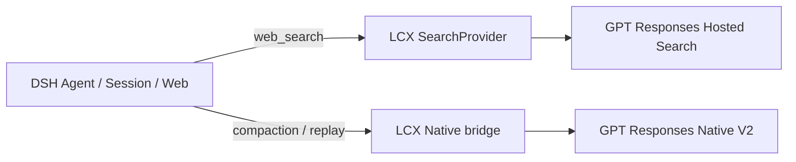

<div align="center">


**让 DeepSeek Harness 直接使用 GPT Hosted Search、Codex Web Actions 与 Native V2 Compaction。**

[](https://www.npmjs.com/package/dsh-lcx-codex)
[](https://github.com/kk3ya03-star/dsh-lcx-codex/actions/workflows/publish.yml)


**简体中文** · [English](README_EN.md) · [Architecture](ARCHITECTURE.md) · [Changelog](CHANGELOG.md)

</div>

---

## 快速开始

前提：DSH 中已经有一个可工作的 GPT `openai-responses` route。

```powershell
dsh plugin --profile web add dsh-lcx-codex
dsh web
```

然后在 DSH Settings 中启用插件。你可以只开启需要的能力：普通 GPT Hosted Search、Advanced/Alpha Search，以及 Native V2 Compaction 都是独立开关。

> `dsh-lcx-codex` 不修改 DSH 核心代码，也不替换 DSH 的 Agent、Session、Web 或 Compaction 系统。DSH 仍然负责会话与执行生命周期；插件只补充 GPT Responses 路径缺失的原生能力。

## 它给 DSH 增加了什么

| 能力 | 你得到什么 | 是否改变 DSH 原有入口 |
|---|---|---|
| **GPT Hosted Search** | DSH 原生 `web_search` 直接走当前 GPT Responses route | **不改变**，仍是 `web_search` |
| **Advanced Hosted Search** | 域名过滤、位置、search context、图片搜索等高级 Hosted 参数 | 新增可选工具 |
| **Codex / Alpha Web Actions** | `search → open → find/click → screenshot`，以及结构化 Web actions | 新增可选工具 |
| **Native V2 Compaction** | 长会话优先使用 provider-native compaction checkpoint | 复用 DSH 原有 compaction 生命周期 |
| **Session-safe replay** | Compact 后继续对话、重启恢复、fork 安全迁移 | 内置 |

### 1. 普通搜索：继续用 DSH `web_search`

启用 GPT Hosted Search 后，模型看到的仍然是 DSH 原生 `web_search`。插件只替换 SearchProvider，把普通搜索映射到当前 Agent 的 GPT Hosted Search。

这意味着日常搜索不需要再给模型增加第二个“普通搜索工具”，也不用让用户在多个重复入口之间选择。

### 2. 需要更强控制时，再开 Advanced / Alpha

三个搜索入口的用途并不重复：

| 场景 | 使用入口 | 适合做什么 |
|---|---|---|
| 日常联网搜索 | DSH `web_search` | 普通查询、找资料、检索网页 |
| 需要 Hosted 高级参数 | `websearch_gpt_advanced` | 域名 allow/block、approximate location、search context、图片搜索等 |
| 需要连续浏览网页 | `websearch_alpha` | `search/open/find/click/screenshot`，以及 finance/weather/sports/time 等结构化 action |

`websearch_gpt_advanced` 默认关闭。`websearch_alpha` 也默认关闭，并且只有当前 endpoint / provider / model / schema 通过 capability probe 后才会启用；未知部署不会被误报为“支持”。

### 3. Native V2 Compaction：长会话优先走原生压缩

插件不会另起一套 compaction engine。DSH 仍然负责 pressure、compactable range、`/compact`、durable session transaction、tool-result pruning 和 overflow recovery；LCX 只在 DSH 的 compaction LLM seam 上请求 Responses Native V2。

默认自动策略：

```text
0% ─────────────────── 90% ───── 95% ───── 100%
       normal            Native      emergency   hard cap
                         V2          DSH prune
```

- **90%**：优先尝试 Native V2；
- **95%**：才允许 emergency DSH prune；
- provider-confirmed context overflow：继续使用 DSH 原有恢复逻辑；
- 手动 `/compact`：仍然走 DSH 原生会话事务。

Compact 后，插件还会保护会话连续性：同一 session 可以直接复用 Native checkpoint；fork / model migration 不会跨 session 发送 parent 的 opaque state，而是走 portable migration；重启后可从 DSH session log 恢复。

## 工作方式



**DSH 是 host，LCX 是兼容扩展层。** 插件优先复用 DSH 当前 route 的 `baseURL`、credential reference、headers、模型与 retry policy，而不是维护第二套账号配置。

如果你关心 checkpoint、canonical replay、Pi serializer、cache identity、fork safety 和 pressure coordination 的实现细节，请直接看 [ARCHITECTURE.md](ARCHITECTURE.md)。README 只保留用户需要知道的行为边界。

## 推荐设置

| 设置 | 推荐值 | 说明 |
|---|---:|---|
| Enable plugin | On | 启用插件 |
| Use GPT Hosted Search | 按需 | 让 DSH `web_search` 走 GPT Hosted Search |
| Advanced Hosted Search | Off | 只有需要高级搜索参数时再开 |
| Alpha Search | Off | capability 验证后再开 |
| Native V2 remote compaction | On* | *上游 route 实际支持 Native V2 时 |
| Native-first auto compaction | On | 自动 pressure 策略 |
| Native threshold | 90% | 90% 开始优先 Native V2 |
| Emergency DSH prune | 95% | 95% 才允许 emergency prune |
| `web_search` timeout | 240 s | 避免长搜索被过早终止 |

主要配置字段：`remoteCompaction`、`autoCompaction`、`fallbackToBasicCompaction`、`autoCompactionThresholdPercent`、`emergencyPruneThresholdPercent`、`webSearchTimeoutSeconds`、`advancedHostedSearch`、`alphaSearch`。

## 要求与兼容性

- Node.js `>=20`
- DSH 中已有可工作的 GPT `openai-responses` route
- upstream 实际支持你启用的 Hosted Search / Native V2 / Alpha 能力

当前正式验证组合：

| Plugin | DSH | DSH host Pi | Plugin Pi | 状态 |
|---|---|---|---|---|
| `0.4.0` | `0.1.1-rc.2` | `0.82.1` | `0.82.1` | **VERIFIED** |

**新的 DSH 版本不会自动视为兼容。** 项目会先检查受影响的 DSH / Pi seam，再按风险运行对应测试；Pi registry 单独出现新版本也不会自动升级插件依赖。

## 其他安装方式

<details>
<summary><strong>预发布版</strong></summary>

```powershell
dsh plugin --profile web add dsh-lcx-codex@next
```

</details>

<details>
<summary><strong>本地 tarball</strong></summary>

```powershell
dsh plugin --profile web remove dsh-lcx-codex
dsh plugin --profile web add .\dsh-lcx-codex-0.4.0.tgz
dsh web
```

</details>

升级插件时，不要为了“清理”删除 DSH session 或 `$DSH_HOME/storages/lcx-codex/`。旧会话可能仍引用历史兼容数据。

## 常见情况

**`web_search` 没走 GPT Hosted Search**  
确认插件和 Hosted Search 已启用，并且当前 Agent 有可解析的 GPT `openai-responses` route。

**`websearch_alpha` 没出现**  
这是预期的 fail-closed 行为。Alpha 必须对当前 route/schema 完成可信 capability probe 后才注册。

**Native V2 没有生效**  
确认当前 GPT Responses endpoint 实际支持 `remote_compaction_v2`。插件不会把普通 Basic Compaction 假装成 Native V2 成功。

## 开发

```bash
npm test
npm run test:schema
npm pack --ignore-scripts
```

- 设计与协议细节：[ARCHITECTURE.md](ARCHITECTURE.md)
- 版本变化：[CHANGELOG.md](CHANGELOG.md)
- npm：[`dsh-lcx-codex`](https://www.npmjs.com/package/dsh-lcx-codex)

## License

MIT

> `LCX` 只是项目名称。本项目是社区项目，不隶属于 OpenAI、DeepSeek、Sub2API 或 NewAPI。
