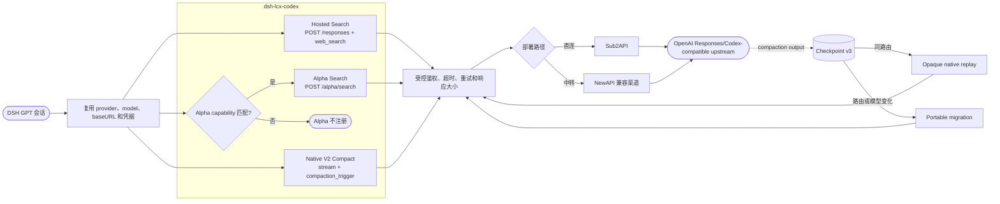

# dsh-lcx-codex

**简体中文** | [English](README_EN.md)

[](https://www.npmjs.com/package/dsh-lcx-codex)
[](LICENSE)

社区维护的 DSH 插件，为兼容 OpenAI Responses/Codex 协议的 GPT 模型增加 Hosted Web Search、Alpha Search 和 Native V2 远程压缩。

> [!IMPORTANT]
> Alpha Search 有 5 种可用部署路径：Sub2API 直连，以及经 NewAPI 的 4 种渠道类型：`Sub2API`、`New API`、`ChatGPT Subscription (Codex)`、`Advanced Custom`。普通 `OpenAI` 渠道不支持 `/v1/alpha/search`，会在 NewAPI 内被拒绝。

这份名单来自 NewAPI 当前主分支的 [`AlphaSearchHelper`](https://github.com/QuantumNous/new-api/blob/f116414284162ad15d8925f7bca494c109b83e93/relay/alpha_search_handler.go)。不同版本的 NewAPI 可能有差异，最终以实际 capability probe 为准。

`LCX` 只是插件名称，不是服务商或协议。本插件支持：

- 直接使用 Sub2API 反代的 GPT 模型。
- 使用 NewAPI 中转的 GPT 模型（也就是第三方中转）；NewAPI 的上游渠道连接 Sub2API。



本项目不隶属于 OpenAI，也不是 OpenAI 官方发布的插件或 OAuth 客户端。

## 功能

| 功能 | 工具或协议 | 说明 |
|---|---|---|
| Hosted Web Search | `websearch_gpt` | `/responses` + `web_search`，返回正文、来源和 citations |
| Alpha Search | `websearch_alpha` | `/alpha/search`，支持 search、open/find/click、PDF screenshot、image、finance、weather、sports 和 time |
| Native V2 Compact | `/responses` + `compaction_trigger` | 保存 checkpoint v3，支持同路由回放、模型迁移、fork/tree、重启和图片 attachment |

Alpha 只有在 capability 记录与当前 endpoint、provider、model 和 schema 匹配时才会启用。Hosted 与 Alpha 是两条独立协议，不会互相静默降级。

## 安装

推荐从 npm 安装：

```powershell
dsh plugin --profile web add dsh-lcx-codex
```

也可以下载 GitHub Release 中的 `.tgz` 安装指定版本：

```powershell
dsh plugin --profile web add .\dsh-lcx-codex-0.3.2.tgz
```

安装后启动 DSH：

```powershell
dsh web
```

打开 `设置 -> 插件 -> LCX / Codex 能力`，按需启用 Hosted、Alpha 或 Native Compact。插件默认关闭。

## 要求

- Node.js 20 或更高版本
- DSH `0.1.0-rc.8` 或兼容版本
- 已在 DSH 中添加并能正常对话的 GPT 模型
- 模型使用 `llm-pi-ai` 的 `openai-responses` provider

插件复用当前 DSH 模型的 provider、model、Responses 地址、凭据引用、headers 和 retry policy，并通过 DSH credentials service 取凭据。正常运行不需要再给插件配置一份 `LCX_API_KEY`。

界面中的 endpoint 和 model 字段用于没有活动会话路由时的默认选择，以及旧版直连配置兼容；同名 DSH provider 已存在时，以 DSH provider 配置为准。

## Alpha probe

Alpha 能力按部署记录为 `native`、`command-capable`、`emulated-search-only`、`unsupported` 或 `unknown`。HTTP 200 本身不能证明 action 是原生能力。

探针是 DSH runtime 外的独立 Node.js 脚本，不能调用 DSH credentials service，因此探针需要本机 key 文件；插件运行时不需要重复配置。

```powershell
$dshHome = if ($env:DSH_HOME) { $env:DSH_HOME } else { Join-Path $env:USERPROFILE '.dsh' }
$env:LCX_API_KEY_FILE = 'C:\path\to\local-key.txt'
$env:LCX_MODEL = '实际模型名'
node (Join-Path $dshHome 'profiles\web\node_modules\dsh-lcx-codex\scripts\probe-alpha.mjs')
```

要同时探测 image、finance、weather、sports 和 time：

```powershell
$env:LCX_ALPHA_PROBE_STRUCTURED = '1'
node (Join-Path $dshHome 'profiles\web\node_modules\dsh-lcx-codex\scripts\probe-alpha.mjs')
```

探针不会输出 key 或完整响应正文。完成后重启 DSH，或关闭再开启 Alpha 设置。

## 数据与限制

- 网络目标由当前活动 DSH `openai-responses` provider 的 `baseURL` 决定，不固定到 LCX 或其他域名；插件只在该地址下调用 `/responses` 和 `/alpha/search`
- 凭据名称取自同一 provider 的 `apiKeyEnv`，并由 DSH credentials service 解析；插件不会自行保存 API key
- Checkpoint：`$DSH_HOME/storages/lcx-codex/checkpoints-v3.json`
- Alpha capability：`$DSH_HOME/storages/lcx-codex/web-alpha-capabilities.json`
- Alpha refs：`$DSH_HOME/storages/lcx-codex/web-alpha-refs.json`
- 只支持 Native remote-compaction V2，不调用 `/responses/compact`
- 同路由 replay 会复用 DSH session 的 `prompt_cache_key` 并保持已有请求前缀稳定；短期缓存过期后仍可能出现单次冷请求，不能用会话累计命中率判断插件是否破坏缓存
- Sub2API 的 Codex OAuth 转换层会删除上游不支持的 `prompt_cache_retention`，因此经该路径设置 `24h` 不会延长缓存；以实际连续请求的 `cached_tokens` 为准
- Checkpoint 不保存图片原始字节或 data URL
- Opaque checkpoint 不跨不兼容 provider、model、base URL、session 或 lineage 回放
- 不包含图片生成功能

不要把 API key、OAuth token、Authorization header、账户 ID、session cookie 或运行时 sidecar 提交到 GitHub。

## 更新与卸载

```powershell
dsh plugin --profile web update dsh-lcx-codex
dsh plugin --profile web remove dsh-lcx-codex
```

卸载不会删除 `$DSH_HOME/storages/lcx-codex/`。如果会话仍引用 checkpoint marker，不要单独删除对应 sidecar。

## 开发

```powershell
npm install
npm test
npm run test:schema
```

真实 E2E 和 Alpha probe 只应读取本机忽略文件或环境变量中的测试凭据。

## License

[MIT](LICENSE)
