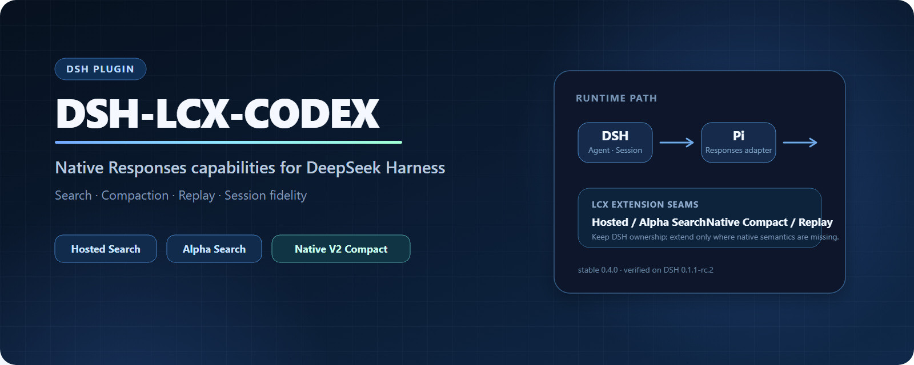

<div align="center">



[](https://www.npmjs.com/package/dsh-lcx-codex)
[](https://github.com/kk3ya03-star/dsh-lcx-codex/actions/workflows/publish.yml)


[简体中文](README.md) · **English** · [Architecture](ARCHITECTURE.md) · [Changelog](CHANGELOG.md)

</div>

`dsh-lcx-codex` is a plugin for **DSH + GPT / OpenAI Responses**.

It does not replace DSH. DSH still owns the Agent, Session, model selection, tool execution, attachments, and the decision of when to compact. With **LCX ON**, LCX only takes over the final Responses request/stream path for GPT conversations, so ordinary turns, tool continuations, Native Compact, and Replay stay on the same wire path.

Current stable release: **0.4.2**.

## Install

```powershell
dsh plugin --profile web add dsh-lcx-codex
dsh web
```

Requirements:

- DSH `0.1.1-rc.2`
- Node.js `^22.19.0 || >=24.0.0`
- a working GPT Responses route already configured in DSH

## What changed in 0.4.2

The main change in 0.4.2 is not another tool. It is a cleaner GPT Responses request path.

Previously LCX mainly handled Native Compact / Replay. With **LCX ON**, the final Responses wire is now owned by LCX from the first ordinary GPT turn:

```text
ordinary turn → tool call → Native Compact → Replay → restart/resume
                  all stay on the same LCX Responses path
```

DSH remains the host. LCX does not maintain a second Agent, Session store, or tool executor.

If you want to switch to Claude, Gemini, DeepSeek, or another non-GPT model, turn LCX off first. No DSH restart is required.

## Features

### GPT Responses lifecycle

With LCX ON, ordinary requests, tool continuations, Native Compact, Native Replay, restart/resume, and GPT model switching share the same request builder and transport.

Compact therefore changes the history representation without also switching to a different request implementation.

### Native V2 Compact / Replay

DSH decides when to compact. LCX sends that compaction through the provider-native Responses V2 path and stores the resulting Native state back in the DSH Session.

Default policy:

```text
< 90%       normal operation
90%         prefer Native V2 Compact
95%         allow DSH emergency prune
```

Manual `/compact` still uses the normal DSH compaction transaction.

A compatible GPT route in the same session can continue with Native state. When the route is incompatible, LCX falls back to portable history instead of reusing unsafe opaque state.

### Prompt Cache

For compatible GPT-5.6 routes, 0.4.2 uses the current `prompt_cache_options` path and keeps a stable cache identity. Long conversations and tool-heavy workloads can keep reusing a warm prefix while the request structure stays stable.

Native Compact intentionally creates a new history prefix, so warming a new cache epoch after Compact is expected.

There is one known edge case: some skills register new top-level tools at runtime. When the `tools` schema changes, the provider may miss the old cache once. The new tool topology warms again on subsequent requests. The plugin prefers correct tool definitions over guessing tool provenance just to save that one cache miss.

### Hosted Search

Ordinary web search still uses DSH's native `web_search`. LCX can route it through the active GPT Hosted Search backend without exposing a duplicate ordinary-search tool to the model.

Optional tools:

- `websearch_gpt_advanced` for Hosted Search controls such as domains, location, search context, and image search
- `websearch_alpha` for stateful `search / open / find / click / screenshot`

Alpha is off by default and is registered only after its capability probe passes.

### Pi 0.84.3

The plugin uses its own `@earendil-works/pi-ai 0.84.3` dependency without overriding DSH's Pi version:

```text
DSH 0.1.1-rc.2
└─ host Pi 0.82.1

dsh-lcx-codex 0.4.2
└─ plugin Pi 0.84.3
```

This gives LCX the newer Responses serialization, reasoning replay, strict / grammar / custom tools, `additional_tools`, `tool_search`, and related behavior without forcing an upgrade of the DSH host stack.

## Suggested settings

| Setting | Suggested |
|---|---|
| Enable LCX | On for GPT Responses conversations |
| Use GPT Hosted Search | As needed |
| Advanced Hosted Search | Off by default |
| Alpha Search | Off by default |
| Native-first auto compaction | On |
| Native threshold | `90%` |
| Emergency DSH prune | `95%` |
| Fallback to Basic Compaction | On |
| `web_search` timeout | `240s` |

## Known limits

- The supported DSH target is still `0.1.1-rc.2`; `0.1.2-alpha.1` is not part of the formal compatibility claim yet.
- The commonly used route currently rejects content-level `prompt_cache_breakpoint`, so explicit breakpoint controls are not exposed.
- Dynamic skills/plugins that change top-level tools can cause a one-time Prompt Cache reset; tool execution remains correct.
- `reasoning.context`, `reasoning.mode`, and similar controls are available only when the current DSH / Pi stack actually exposes them.
- 1.05M long context and Programmatic Tool Calling are not advertised as supported in 0.4.2.

## Compatibility

| Plugin | DSH | DSH host Pi | Plugin Pi |
|---|---|---|---|
| `0.4.2` | `0.1.1-rc.2` | `0.82.1` | `0.84.3` |

## Development

```bash
npm run typecheck
npm test
npm run test:schema
npm pack --ignore-scripts
```

See [ARCHITECTURE.md](ARCHITECTURE.md) for protocol and implementation details, and [CHANGELOG.md](CHANGELOG.md) for release history.

## License

MIT

> `LCX` is only the project name. This is a community project and is not affiliated with OpenAI, DeepSeek, Sub2API, or NewAPI.
