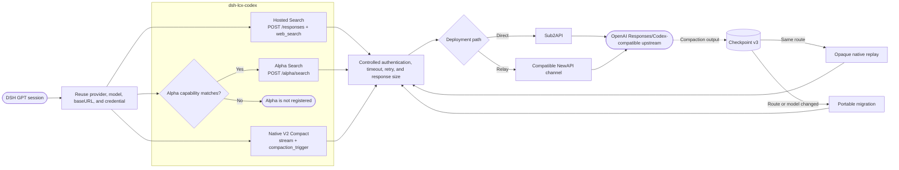

# dsh-lcx-codex

[Chinese](README.md) | **English**

[](https://www.npmjs.com/package/dsh-lcx-codex)
[](LICENSE)

A community-maintained DSH plugin that adds Hosted Web Search, Alpha Search, and Native V2 remote compaction to GPT models served through an OpenAI Responses/Codex-compatible API.

> [!IMPORTANT]
> Alpha Search currently has five supported deployment paths: a direct Sub2API connection, or one of four NewAPI channel types: `Sub2API`, `New API`, `ChatGPT Subscription (Codex)`, and `Advanced Custom`. A regular `OpenAI` channel does not support `/v1/alpha/search` and is rejected by NewAPI.

This list comes from NewAPI's current [`AlphaSearchHelper`](https://github.com/QuantumNous/new-api/blob/f116414284162ad15d8925f7bca494c109b83e93/relay/alpha_search_handler.go). Other NewAPI versions may differ, so the capability probe remains authoritative for a specific deployment.

`LCX` is only the plugin name. It is not a service provider or protocol. The plugin supports GPT models served through:

- A direct Sub2API reverse proxy.
- A NewAPI relay, meaning a third-party relay whose upstream channel connects to Sub2API.



This project is not affiliated with OpenAI and is not an official OpenAI plugin or OAuth client.

## Features

| Feature | Tool or protocol | Behavior |
|---|---|---|
| Hosted Web Search | `websearch_gpt` | Uses `/responses` with `web_search` and returns text, direct sources, and citations |
| Alpha Search | `websearch_alpha` | Uses `/alpha/search` for search, image, open/find/click, PDF screenshot, finance, weather, sports, and time actions |
| Native V2 Compact | `/responses` with `compaction_trigger` | Stores checkpoint v3 and supports same-route replay, model migration, fork/tree sessions, restart recovery, and image attachments |

Alpha is enabled only when a capability record matches the current endpoint, provider, model, and schema. Hosted and Alpha are separate protocols and never silently fall back to each other.

## Installation

Install from npm:

```powershell
dsh plugin --profile web add dsh-lcx-codex
```

You can also install a specific `.tgz` file from a GitHub Release:

```powershell
dsh plugin --profile web add .\dsh-lcx-codex-0.3.2.tgz
```

Start DSH after installation:

```powershell
dsh web
```

Open `Settings -> Plugins -> LCX / Codex capabilities` and enable Hosted, Alpha, or Native Compact as needed. The plugin is disabled by default.

## Requirements

- Node.js 20 or later
- DSH `0.1.0-rc.8` or a compatible release
- A GPT model already added to DSH and working in a normal conversation
- The model must use the `openai-responses` provider from `llm-pi-ai`

The plugin reuses the active DSH model's provider, model, Responses URL, credential reference, headers, and retry policy. Normal plugin operation does not require a second `LCX_API_KEY` configuration.

The endpoint and model fields in the plugin UI are defaults for cases without an active session route and for compatibility with the older direct-route configuration. An existing DSH provider configuration takes precedence.

## Alpha Probe

Alpha capability is classified as `native`, `command-capable`, `emulated-search-only`, `unsupported`, or `unknown`. An HTTP 200 response alone does not prove that an action is native.

The probe is a standalone Node.js script outside the DSH runtime, so it cannot use the DSH credentials service. It requires a local key file; normal plugin operation does not.

```powershell
$dshHome = if ($env:DSH_HOME) { $env:DSH_HOME } else { Join-Path $env:USERPROFILE '.dsh' }
$env:LCX_API_KEY_FILE = 'C:\path\to\local-key.txt'
$env:LCX_MODEL = 'the-exact-model-name'
node (Join-Path $dshHome 'profiles\web\node_modules\dsh-lcx-codex\scripts\probe-alpha.mjs')
```

To also probe image, finance, weather, sports, and time actions:

```powershell
$env:LCX_ALPHA_PROBE_STRUCTURED = '1'
node (Join-Path $dshHome 'profiles\web\node_modules\dsh-lcx-codex\scripts\probe-alpha.mjs')
```

The probe does not print the key or full response bodies. Restart DSH, or disable and re-enable Alpha, after the probe completes.

## Data and Limits

- The runtime network target is determined by the active DSH `openai-responses` provider's `baseURL`; it is not fixed to LCX or any other domain. The plugin only calls `/responses` and `/alpha/search` under that address.
- The credential name comes from the same provider's `apiKeyEnv` and is resolved by the DSH credentials service. The plugin does not store API keys.
- Checkpoints: `$DSH_HOME/storages/lcx-codex/checkpoints-v3.json`
- Alpha capabilities: `$DSH_HOME/storages/lcx-codex/web-alpha-capabilities.json`
- Alpha references: `$DSH_HOME/storages/lcx-codex/web-alpha-refs.json`
- Only Native remote-compaction V2 is supported; `/responses/compact` is never called.
- Same-route replay reuses the DSH session `prompt_cache_key` and preserves the existing request prefix. A single cold request can still occur after the short-lived upstream cache expires, so the cumulative session hit rate is not evidence that the plugin changed the prefix.
- Sub2API strips the unsupported `prompt_cache_retention` field on its Codex OAuth path, so requesting `24h` does not extend cache lifetime on that route. Use the `cached_tokens` reported by consecutive real requests as the authoritative signal.
- Checkpoints never store raw image bytes or data URLs.
- Opaque checkpoints are not replayed across an incompatible provider, model, base URL, session, or lineage.
- Image generation is not included.

Never commit API keys, OAuth tokens, Authorization headers, account IDs, session cookies, or runtime sidecars to GitHub.

## Update and Removal

```powershell
dsh plugin --profile web update dsh-lcx-codex
dsh plugin --profile web remove dsh-lcx-codex
```

Removal does not delete `$DSH_HOME/storages/lcx-codex/`. Do not delete a checkpoint sidecar by itself while a session still references its marker.

## Development

```powershell
npm install
npm test
npm run test:schema
```

Real E2E tests and the Alpha probe must read test credentials only from ignored local files or environment variables.

## License

[MIT](LICENSE)
