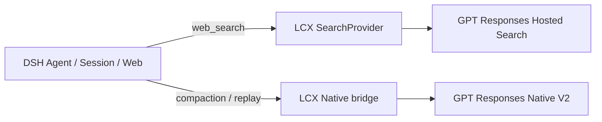

<div align="center">


**Bring GPT Hosted Search, Codex Web Actions and Native V2 Compaction into DeepSeek Harness.**

[](https://www.npmjs.com/package/dsh-lcx-codex)
[](https://github.com/kk3ya03-star/dsh-lcx-codex/actions/workflows/publish.yml)


[简体中文](README.md) · **English** · [Architecture](ARCHITECTURE.md) · [Changelog](CHANGELOG.md)

</div>

---

## Quick start

Prerequisite: DSH already has a working GPT `openai-responses` route.

```powershell
dsh plugin --profile web add dsh-lcx-codex
dsh web
```

Enable the plugin in DSH Settings. Each capability is optional: ordinary GPT Hosted Search, Advanced/Alpha Search, and Native V2 Compaction can be enabled independently.

> `dsh-lcx-codex` does not modify DSH core and does not replace DSH Agent, Session, Web or Compaction. DSH remains the lifecycle owner; the plugin only fills missing native capabilities on GPT Responses routes.

## What it adds to DSH

| Capability | What you get | Changes the existing DSH entry? |
|---|---|---|
| **GPT Hosted Search** | Native DSH `web_search` follows the active GPT Responses route | **No** — it remains `web_search` |
| **Advanced Hosted Search** | Domain filters, location, search context, image search and other Hosted controls | Adds an optional tool |
| **Codex / Alpha Web Actions** | `search → open → find/click → screenshot` plus structured Web actions | Adds an optional tool |
| **Native V2 Compaction** | Long sessions prefer provider-native compaction checkpoints | Reuses DSH compaction lifecycle |
| **Session-safe replay** | Continue after compact, survive restart, migrate forks safely | Built in |

### 1. Ordinary search: keep using DSH `web_search`

When GPT Hosted Search is enabled, the model still sees the native DSH `web_search` tool. The plugin only replaces the SearchProvider and maps ordinary searches to the active Agent's GPT Hosted Search route.

There is no second duplicate “ordinary search” tool for the model or the user to choose between.

### 2. Enable Advanced / Alpha only when you need more control

The three search entries serve different jobs:

| Use case | Entry | Best for |
|---|---|---|
| Everyday web lookup | DSH `web_search` | Normal queries, research and web retrieval |
| Hosted search controls | `websearch_gpt_advanced` | Domain allow/block, approximate location, search context, image search and related controls |
| Stateful browsing | `websearch_alpha` | `search/open/find/click/screenshot` plus finance/weather/sports/time actions |

`websearch_gpt_advanced` is off by default. `websearch_alpha` is also off by default and is registered only after the exact endpoint / provider / model / schema passes a capability probe. Unknown deployments are not mislabeled as supported.

### 3. Native V2 Compaction: prefer native long-session compression

The plugin does not create another compaction engine. DSH still owns pressure, compactable ranges, `/compact`, durable session transactions, tool-result pruning and overflow recovery. LCX only requests Responses Native V2 at the existing DSH compaction LLM seam.

Default automatic policy:

```text
0% ─────────────────── 90% ───── 95% ───── 100%
       normal            Native      emergency   hard cap
                         V2          DSH prune
```

- **90%**: prefer Native V2;
- **95%**: emergency DSH pruning becomes allowed;
- provider-confirmed context overflow: keep DSH's original recovery path;
- manual `/compact`: keep the normal DSH session transaction.

Session continuity is preserved after compaction. The exact source session can directly reuse its Native checkpoint; forks or model migrations never send a parent's opaque state across sessions and instead use portable migration; restart/resume rebuilds from the DSH session log.

## How it fits



**DSH is the host; LCX is a compatibility extension.** The plugin prefers the active DSH route's `baseURL`, credential reference, headers, model and retry policy instead of maintaining a second account configuration.

For checkpoint internals, canonical replay, Pi serialization, cache identity, fork safety and pressure coordination, see [ARCHITECTURE.md](ARCHITECTURE.md). The README intentionally keeps implementation detail out of the primary user flow.

## Recommended settings

| Setting | Recommended | Notes |
|---|---:|---|
| Enable plugin | On | Enables LCX |
| Use GPT Hosted Search | As needed | Routes DSH `web_search` through GPT Hosted Search |
| Advanced Hosted Search | Off | Enable only for advanced Hosted parameters |
| Alpha Search | Off | Enable after capability verification |
| Native V2 remote compaction | On* | *When the upstream route actually supports Native V2 |
| Native-first auto compaction | On | Enables pressure coordination |
| Native threshold | 90% | Prefer Native V2 from 90% |
| Emergency DSH prune | 95% | Allow emergency prune from 95% |
| `web_search` timeout | 240 s | Avoid false timeout on longer searches |

Key fields: `remoteCompaction`, `autoCompaction`, `fallbackToBasicCompaction`, `autoCompactionThresholdPercent`, `emergencyPruneThresholdPercent`, `webSearchTimeoutSeconds`, `advancedHostedSearch`, `alphaSearch`.

## Requirements and compatibility

- Node.js `>=20`
- a working GPT `openai-responses` route in DSH
- actual upstream support for whichever Hosted Search / Native V2 / Alpha capabilities you enable

Current formally verified stack:

| Plugin | DSH | DSH host Pi | Plugin Pi | Status |
|---|---|---|---|---|
| `0.4.0` | `0.1.1-rc.2` | `0.82.1` | `0.82.1` | **VERIFIED** |

A new DSH release is **not** assumed compatible. The project first reviews the DSH / Pi seams that changed and then runs risk-appropriate tests. A newer Pi registry version alone does not automatically upgrade the plugin dependency.

## Other installation options

<details>
<summary><strong>Prerelease</strong></summary>

```powershell
dsh plugin --profile web add dsh-lcx-codex@next
```

</details>

<details>
<summary><strong>Local tarball</strong></summary>

```powershell
dsh plugin --profile web remove dsh-lcx-codex
dsh plugin --profile web add .\dsh-lcx-codex-0.4.0.tgz
dsh web
```

</details>

Do not delete DSH sessions or `$DSH_HOME/storages/lcx-codex/` just to “clean up” during an upgrade. Older sessions may still reference compatibility data there.

## Common cases

**`web_search` is not using GPT Hosted Search**  
Make sure the plugin and Hosted Search are enabled and the active Agent resolves to a compatible GPT `openai-responses` route.

**`websearch_alpha` is missing**  
That is expected fail-closed behavior. Alpha is registered only after a trusted capability probe succeeds for the current route/schema.

**Native V2 is not taking effect**  
Verify that the current GPT Responses endpoint actually supports `remote_compaction_v2`. The plugin does not present ordinary Basic Compaction as a successful Native V2 run.

## Development

```bash
npm test
npm run test:schema
npm pack --ignore-scripts
```

- Design and protocol details: [ARCHITECTURE.md](ARCHITECTURE.md)
- Release history: [CHANGELOG.md](CHANGELOG.md)
- npm: [`dsh-lcx-codex`](https://www.npmjs.com/package/dsh-lcx-codex)

## License

MIT

> `LCX` is only the project name. This is a community project and is not affiliated with OpenAI, DeepSeek, Sub2API or NewAPI.
