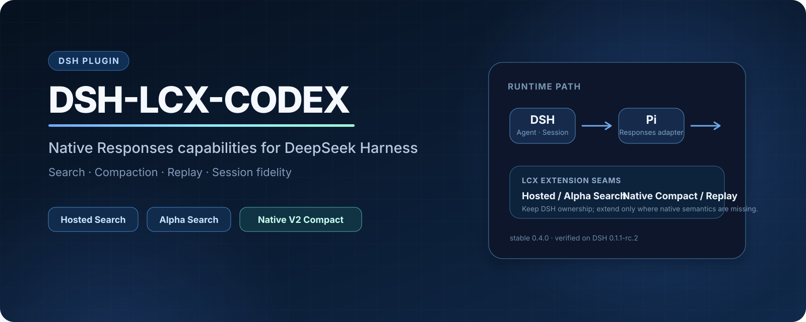

<div align="center">



[](https://www.npmjs.com/package/dsh-lcx-codex)
[](https://github.com/kk3ya03-star/dsh-lcx-codex/actions/workflows/publish.yml)


[简体中文](README.md) · **English** · [Architecture](ARCHITECTURE.md) · [Changelog](CHANGELOG.md)

</div>

OpenAI Responses extensions for DeepSeek Harness: Native V2 Compact / Replay, Hosted Search, Prompt Cache, and stateful web actions.

## Highlights

- **One GPT Responses path** — with LCX enabled, ordinary turns, tool continuations, Compact, and Replay use the LCX Responses path from the first request.
- **Native V2 Compact / Replay** — provider-native compaction for long sessions, with Replay, restart recovery, and safe GPT route switching.
- **GPT Hosted Search** — keep DSH's native `web_search` entry point, with optional advanced search and stateful web actions.
- **Prompt Cache** — GPT-5.6-compatible routes use `prompt_cache_options` and keep a stable cache identity while the request prefix stays stable.
- **DSH stays the host** — DSH still owns the Agent, Session, tool execution, and compaction policy. The plugin's Pi dependency is isolated from the host stack.

## Installation

```powershell
dsh plugin --profile web add dsh-lcx-codex
dsh web
```

Requires:

- DSH `0.1.1-rc.2`
- Node.js `^22.19.0 || >=24.0.0`
- a working GPT Responses route in DSH

The current stable release is **0.4.2** and is published on npm `latest`.

## Quick start

Enable **LCX** in the plugin settings after installation.

```text
LCX OFF  → native DSH LLM path
LCX ON   → the current GPT conversation uses the LCX Responses path from turn 1
```

LCX is only for GPT / OpenAI Responses. Turn it off before switching to Claude, Gemini, DeepSeek, or another non-GPT model. No DSH restart is required for model switching.

## Native V2 Compact / Replay

DSH still decides when to compact. LCX sends the compaction request through Responses Native V2 and stores the result back in the existing DSH Session.

Default pressure policy:

```text
< 90%   normal operation
90%     prefer Native V2 Compact
95%     allow DSH emergency prune
```

Manual `/compact` keeps DSH's normal compaction transaction.

Native state is reused only for a compatible session / route. When switching to an incompatible GPT route, LCX falls back to portable history instead of forcing old opaque state into the request.

## Prompt Cache

On supported GPT-5.6 routes, LCX uses `prompt_cache_options` and keeps a stable cache identity.

Ordinary multi-turn and tool-heavy workloads can continue reusing a warm prefix while the request shape remains unchanged. A new cache epoch is expected when:

- Native Compact rewrites the history;
- a runtime skill / plugin changes the top-level `tools` schema.

The second case currently costs one cache miss, then the new tool topology warms again. Version 0.4.2 keeps tool correctness first rather than guessing dynamic-tool provenance to save that single miss.

## Search

Ordinary search still uses DSH's `web_search`:

```text
DSH web_search → LCX SearchProvider → GPT Hosted Search
```

Optional tools:

- `websearch_gpt_advanced` — Hosted Search controls such as domains, location, search context, and image search
- `websearch_alpha` — stateful `search / open / find / click / screenshot`

Alpha is off by default and is registered only after the active route passes its capability probe.

## Settings

The defaults are a good starting point. Change only what you need.

| Setting | Default / Suggested |
|---|---|
| Enable LCX | On for GPT conversations |
| Use GPT Hosted Search | As needed |
| Advanced Hosted Search | Off |
| Alpha Search | Off |
| Native-first auto compaction | On |
| Native threshold | `90%` |
| Emergency DSH prune | `95%` |
| Fallback to Basic Compaction | On |
| `web_search` timeout | `240s` |

## Compatibility

| Plugin | DSH | DSH host Pi | Plugin Pi | Node.js |
|---|---|---|---|---|
| `0.4.2` | `0.1.1-rc.2` | `0.82.1` | `0.84.3` | `^22.19.0 || >=24` |

`@earendil-works/pi-ai@0.84.3` is a plugin-local dependency and does not override the Pi version used by DSH.

DSH `0.1.2-alpha.1` is not part of the formal 0.4.2 compatibility target yet.

## Known limitations

- The commonly used route currently rejects content-level `prompt_cache_breakpoint`, so explicit breakpoint controls are not exposed.
- Dynamic skills/plugins that change the top-level tool set can cause one Prompt Cache reset; tool execution remains correct.
- `reasoning.context` / `reasoning.mode` are available only when the DSH / Pi stack actually exposes them.
- 1.05M long context and Programmatic Tool Calling are not advertised as supported in 0.4.2.

## Development

```bash
npm run typecheck
npm test
npm run test:schema
npm pack --ignore-scripts
```

See [ARCHITECTURE.md](ARCHITECTURE.md) for request-lifecycle, checkpoint, Replay, and protocol details. See [CHANGELOG.md](CHANGELOG.md) for release history.

## License

MIT

This is an independent community plugin and is not affiliated with or endorsed by OpenAI, DeepSeek, Sub2API, or NewAPI. The DeepSeek name and whale mark belong to their respective rights holder.
